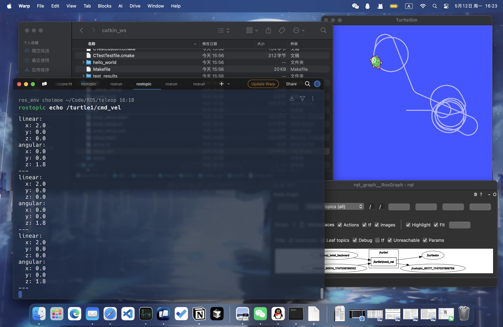
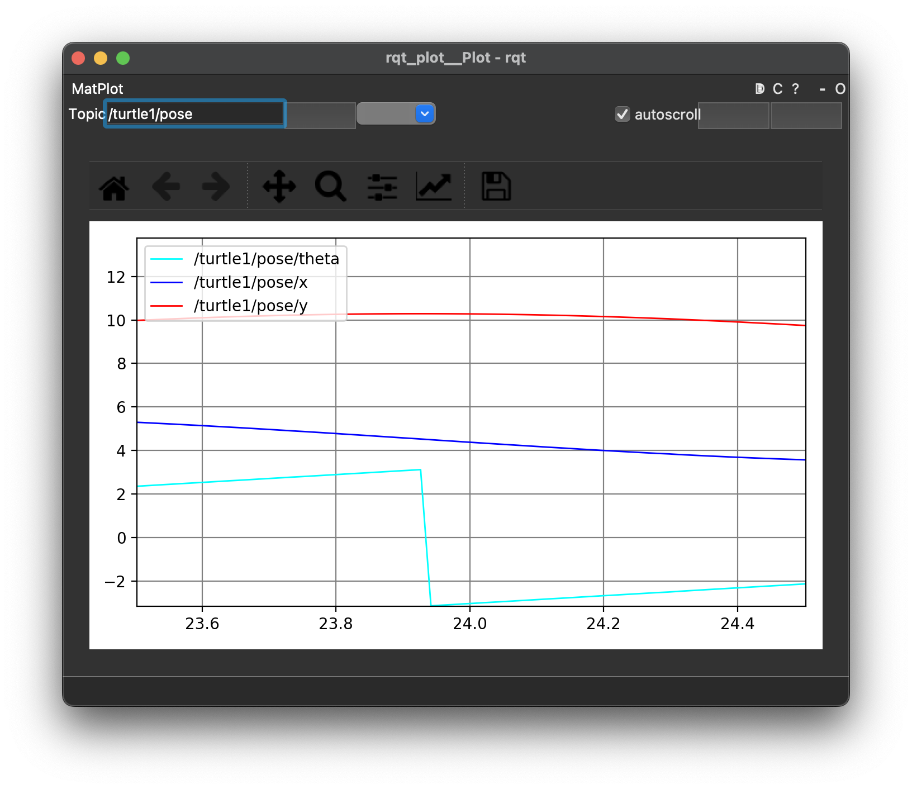

# 机器人ROS实验

```
Created: 2025年5月12日 14:27
Class: 机器人
Author: Choimoe
```

## 配环境

- 使用 conda 配置 ROS 环境
    
    安装 `miniforge` ：
    
    ```bash
    curl -L -O "https://github.com/conda-forge/miniforge/releases/latest/download/Miniforge3-$(uname)-$(uname -m).sh"
    bash Miniforge3-$(uname)-$(uname -m).sh
    ```
    
    安装 `mamba` ：
    
    ```bash
    conda install mamba -c conda-forge
    ```
    
    找一个地方放代码（我的目录是 `~/Code/ROS`）：
    
    ```bash
    mkdir ROS
    mamba create -n ros_env python=3.11
    mamba install ros-noetic-desktop
    ```
    
    似乎使用 `conda` 的话要改一下路径，试一下能不能 `activate` 成功，如果不能执行下面内容：
    
    ```bash
    mamba shell init --shell zsh --root-prefix=~/miniconda3
    ```
    
- 如果遇到 `CMake Error` ，大概率是版本问题
    
    CMake 不支持3.5之前的版本了，所以版本依赖（通常是第一行）改为：
    
    ```cpp
    cmake_minimum_required(VERSION 3.5.2)
    ```
    
    就解决了。
    

## 使用

使用 mamba 安装了 ROS 环境，每次使用时（下面内容无特殊说明均需在该环境运行）：

```bash
mamba activate ros_env
```

命令行启动 ROS：

```bash
roscore
```

## 实验一

海龟UI启动程序：

```bash
rosrun turtlesim turtlesim_node
```

由于使用 conda 所以需要手动安装 `teleop_twist_keyboard`，我 clone 在了 `~/Code/ROS/teleop` 下 `src` 文件夹内并进行手动编译，使用时需要在另一个终端输入：

```bash
source devel/setup.zsh
rosrun teleop_twist_keyboard teleop_twist_keyboard.py
```

注意需要手动修改 `src/teleop_twist_keyboard/teleop_twist_keyboard.py` 的 `Publisher` ，从 `cmd_vel` 改为 `/turtle1/cmd_vel` 。

- 安装 `teleop_twist_keyboard` ：
    
    当前目录在 `~/Code/ROS/` ，执行：
    
    ```bash
    mkdir -p teleop/src
    cd teleop/src
    catkin_init_workspace
    cd ..
    catkin_make
    ```
    
    clone 源代码：
    
    ```bash
    cd src
    git clone https://github.com/ros-teleop/teleop_twist_keyboard.git
    cd ..
    catkin_make
    ```
    

## 实验二

类似上面的构建，在 `ROS` 下输入：

```bash
mkdir -p catkin_ws/src
cd catkin_ws/src
catkin_init_workspace
catkin_create_pkg hello_world roscpp rospy
```

然后新建代码：

```bash
vim hello_world/src/my_hello_world_node.cpp
```

输入：

- 书上的源代码
    
    ```cpp
    #include<ros/ros.h>
    
    int main(int argc,char**argv)
    {
        ros::init(argc,argv,"hello_node");
        ros::NodeHandle nh;
        ROS_INFO_STREAM("hello world!!!");
    }
    ```
    
    我没跑起来，于是修改了一些 `CMakeLists.txt` ：
    
    ```makefile
    add_compile_options(-std=c++14)
    
    add_executable(hello_world src/my_hello_world_node.cpp)
    
    target_link_libraries(${PROJECT_NAME}
      ${catkin_LIBRARIES}
    )
    ```
    

进行编译：

```bash
cd ..
catkin_make
```

运行：

```bash
source devel/setup.zsh
rosrun hello_world hello_world
```

---

在 `catkin_ws` 下输入：

```bash
mkdir -p src/hello_world/scripts
vim src/hello_world/scripts/hello.py
chmod +x src/hello_world/scripts/hello.py
```

- 源代码
    
    ```python
    #!/Users/choimoe/miniconda3/envs/ros_env/bin/python
    # -*- coding: utf-8 -*-
    import rospy
    rospy.init_node("pyhello")
    print("hello ros python")
    ```
    

可以直接运行：

```bash
rosrun hello_world hello.py
```

## 实验三



先运行乌龟：

```bash
roscore
rosrun teleop_twist_keyboard teleop_twist_keyboard.py
rosrun turtlesim turtlesim_node
```

可以监听和画图：

```bash
rostopic echo /turtle1/cmd_vel
rosrun rqt_graph rqt_graph
```

使用 `rostopic pub` 可以发布稳定的命令流：

```bash
rostopic pub /turtle1/cmd_vel geometry_msgs/Twist -r 1 -- '[2.0, 0.0, 0.0]' '[0.0, 0.0, 1.8]'
```

使用 `rosrun rqt_plot rqt_plot` 可以得到：



## 实验四

先运行乌龟：

```bash
roscore
rosrun teleop_twist_keyboard teleop_twist_keyboard.py
rosrun turtlesim turtlesim_node
```

通过 `rosservice` 生成第二只小海龟：

```bash
rosservice call spawn 2 2 0.2 ""
```

使用 `rosparam list` 可以获得参数信息：

```bash
/rosdistro
/roslaunch/uris/host_choimoedemacbook_air_local__64336
/rosversion
/run_id
/turtlesim/background_b
/turtlesim/background_g
/turtlesim/background_r
```

通过 `set` 来修改参数：

```bash
rosparam set /turtlesim/background_r 150
rosservice call clear
```

## 实验五

```bash
cd src/
catkin_create_pkg learning_topic roscpp rospy std_msgs geometry_msgs turtlesim
mkdir -p learning_topic/scripts
vim learning_topic/scripts/velocity_publisher.py
vim learning_topic/scripts/pose_subscriber.py
vim learning_topic/scripts/person_subscriber.py
vim learning_topic/scripts/person_publisher.py
chmod +x src/learning_topic/scripts/*.py
mkdir -p src/learning_topic/msg
vim src/learning_topic/msg/Person.msg
```

- 源代码
    
    `velocity_publisher.py`：
    
    ```python
    #!/Users/choimoe/miniconda3/envs/ros_env/bin/python
    import rospy
    from geometry_msgs.msg import Twist
    def velocity_publisher():
        rospy.init_node('velocity_publisher', anonymous=True)
        turtle_vel_pub = rospy.Publisher('/turtle1/cmd_vel', Twist, queue_size=10)
        rate =rospy.Rate(10)
        while not rospy.is_shutdown():
            vel_msg = Twist()
            vel_msg.linear.x=0.5
            vel_msg.angular.z =0.2
            turtle_vel_pub.publish(vel_msg)
            rospy.loginfo("Publsh turtle velocity command[%0.2fm/s, %0.2frad/s]",
            vel_msg.linear.x, vel_msg.angular.z)
            rate.sleep()
    if __name__ == '__main__':
        try:
            velocity_publisher()
        except rospy.ROSInterruptException:
            pass
    ```
    
    `pose_subscriber.py` ：
    
    ```python
    #!/Users/choimoe/miniconda3/envs/ros_env/bin/python
    import rospy
    from turtlesim.msg import Pose
    def poseCallback(msg):
        rospy.loginfo("Turtle pose: x:%0.6f, y:%0.6f", msg.x, msg.y)
    def pose_subscriber():
        rospy.init_node('pose_subscriber', anonymous=True)
        rospy.Subscriber("/turtle1/pose", Pose, poseCallback)
        rospy.spin()
    if __name__== '__main__':
        pose_subscriber()
    ```
    
    `person_subscriber.py` ：
    
    ```python
    #!/Users/choimoe/miniconda3/envs/ros_env/bin/python
    import rospy
    from learning_topic.msg import Person
    
    def personInfoCallback(msg):
        rospy.loginfo("Subcribe Person Info: name:%s age:%d sex:%d",msg.name, msg.age,msg.sex)
    
    def person_subscriber():
        rospy.init_node('person_subscriber', anonymous=True)
        rospy.Subscriber("/person_info", Person, personInfoCallback)
        rospy.spin()
    if  __name__== '__main__':
        person_subscriber()
    ```
    
    `person_publisher.py` ：
    
    ```python
    #!/Users/choimoe/miniconda3/envs/ros_env/bin/python
    import rospy
    from learning_topic.msg import Person
    import time
    def velocity_publisher():
        rospy.init_node('person_publisher', anonymous=True)
        person_info_pub = rospy.Publisher('/person_info', Person, queue_size=10)
        rate =rospy.Rate(10)
        while not rospy.is_shutdown():
            person_msg = Person()
            person_msg.name = "Tom"; person_msg.age=18;
            person_msg.sex=Person.male;
            person_info_pub.publish(person_msg)
            rospy.loginfo("Publsh person message[%s, %d, %d]",person_msg.name, person_msg.age, person_msg.sex)
            rate.sleep()
            time.sleep(1)
    if __name__ =='__main__':
        try:
            velocity_publisher()
        except rospy.ROSInterruptException:
            pass
    ```
    
    `Person.msg` ：
    
    ```bash
    string name
    uint8 sex
    uint8 age
    
    uint8 unknown=0
    uint8 male=1
    uint8 female=2
    ```
    
- 需要在 `CMakeLists.txt` 中修改
    
    ```makefile
    add_message_files(
      FILES
      Person.msg
    )
    generate_messages(
      DEPENDENCIES
      geometry_msgs#   std_msgs
    )
    catkin_package(
      INCLUDE_DIRS include
      LIBRARIES learning_topic
      CATKIN_DEPENDS geometry_msgs roscpp rospy std_msgs turtlesim
      DEPENDS system_lib
    )
    ```
    
    令在 `package.xml` 中添加：
    
    ```xml
    <build_depend>message_generation</build_depend>
    <exec_depend>message_runtime</exec_depend>
    ```
    

先运行乌龟：

```bash
roscore
rosrun turtlesim turtlesim_node
```

运行我们的程序：

```bash
rosrun learning_topic pose_subscriber.py
```

```bash
rosrun learning_topic velocity_publisher.py
```

---

自定义消息：

```bash
rosrun learning_topic person_subscriber.py
```

```xml
rosrun learning_topic person_publisher.py
```

## 实验六

代码略，在终端中执行：

```xml
rosrun learning_service turtle_command_server
```

生成小海龟：

```xml
rosrun learning_service turtle_spawn
```

转圈，第二次执行停止：

```xml
rosservice call /turtle_command "{}"
```

---

```xml
rosrun learning_service person_server
```

```xml
rosrun learning_service person_client
```